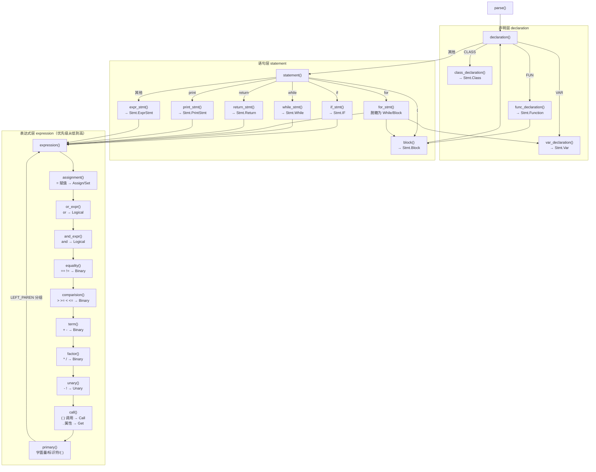
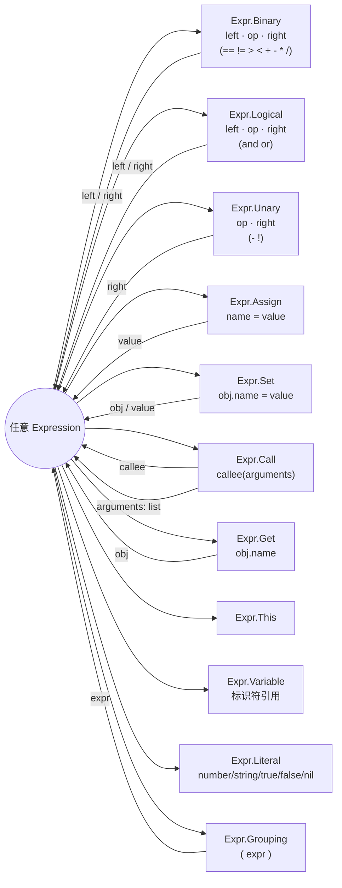

# Parser 语法树解析关系图

本文档用 mermaid 图展示 `pox/parser.py` 的递归下降解析结构，
以及 `pox/statement.py`、`pox/expression.py` 中 AST 节点的组合关系。

## 1. Parser 方法调用层次（递归下降结构）



## 2. 语句节点（`Stmt.*`）的结构关系

```mermaid
flowchart LR
    subgraph Program["parse() → list&#91;Statement&#93;"]
        Class["Stmt.Class<br/>(name, methods)"]
        Function["Stmt.Function<br/>(name, params, block)"]
        Var["Stmt.Var<br/>(name, initializer?)"]
        Block["Stmt.Block<br/>(statements)"]
        IF["Stmt.IF<br/>(condition, consequent, alternative?)"]
        While["Stmt.While<br/>(condition, statement)"]
        Return["Stmt.Return<br/>(value)"]
        PrintStmt["Stmt.PrintStmt<br/>(expr)"]
        ExprStmt["Stmt.ExprStmt<br/>(expr)"]
    end

    Class -->|"methods: list"| Function
    Function --> Block
    Block -->|"statements: list"| AnyStmt["任意 Statement"]
    Var -->|initializer?| ExprAny["任意 Expression"]
    IF -->|condition| ExprAny
    IF -->|consequent / alternative?| AnyStmt
    While -->|condition| ExprAny
    While -->|statement| AnyStmt
    Return -->|value| ExprAny
    PrintStmt -->|expr| ExprAny
    ExprStmt -->|expr| ExprAny
```



## 3. 表达式节点（`Expr.*`）的结构关系



## 4. 标准 Lox 的完整上下文无关文法（参考）

以下为 *Crafting Interpreters* 中 Lox 语言的完整文法，
作为正确实现的参考基准（与 `docs/pox-grammar.md` 中按 pox 实际代码
整理的文法对照使用）。

```ebnf
program        ::= declaration* EOF ;

declaration    ::= classDecl | funDecl | varDecl | statement ;

classDecl      ::= "class" IDENTIFIER ( "<" IDENTIFIER )? "{" function* "}" ;
                               (* "( "<" IDENTIFIER )?" 为继承，pox 未实现 *)

funDecl        ::= "fun" function ;

function       ::= IDENTIFIER "(" parameters? ")" block ;
                   (* 顶层函数与类方法共用此产生式，
                      类体中的方法省略 "fun" 关键字 *)

parameters     ::= IDENTIFIER ( "," IDENTIFIER )* ;

varDecl        ::= "var" IDENTIFIER ( "=" expression )? ";" ;

statement      ::= exprStmt | forStmt | ifStmt
                 | printStmt | returnStmt | whileStmt | block ;

exprStmt       ::= expression ";" ;

forStmt        ::= "for" "(" ( varDecl | exprStmt | ";" )
                          expression? ";"
                          expression? ")"
                   statement ;          (* 循环体为任意 statement，不限于 block *)

ifStmt         ::= "if" "(" expression ")" statement
                   ( "else" statement )? ;

printStmt      ::= "print" expression ";" ;

returnStmt     ::= "return" expression? ";" ;

whileStmt      ::= "while" "(" expression ")" statement ;

block          ::= "{" declaration* "}" ;

(* ============ 表达式：优先级自低到高 ============ *)

expression     ::= assignment ;

assignment     ::= ( call "." )? IDENTIFIER "=" assignment
                 | logic_or ;           (* 右结合；用左部模式匹配实现，
                                          而非先解析再判断节点类型 *)

logic_or       ::= logic_and ( "or" logic_and )* ;    (* 左结合，可链式 *)

logic_and      ::= equality ( "and" equality )* ;     (* 左结合，可链式 *)

equality       ::= comparison ( ( "!=" | "==" ) comparison )* ;

comparison     ::= term ( ( ">" | ">=" | "<" | "<=" ) term )* ;

term           ::= factor ( ( "-" | "+" ) factor )* ;

factor         ::= unary ( ( "/" | "*" ) unary )* ;

unary          ::= ( "!" | "-" ) unary | call ;

call           ::= primary ( "(" arguments? ")" | "." IDENTIFIER )* ;

arguments      ::= expression ( "," expression )* ;

primary        ::= "true" | "false" | "nil" | "this"
                 | NUMBER | STRING | IDENTIFIER
                 | "(" expression ")"
                 | "super" "." IDENTIFIER ;           (* pox 未实现 *)
```

### pox 实现与标准文法的差异速览

| 项目 | 标准 Lox | pox 当前实现 |
|---|---|---|
| 赋值右部 | `assignment`（右结合，可嵌套） | `or_expr`（不可嵌套） |
| `or` / `and` | 独立产生式，`*` 循环，左结合 | 混在 `and_expr`，`?` 单层，接受 `"and"\|"or"` |
| `for` 循环体 | 任意 `statement` | 只能是 `block`（解析期脱糖） |
| 类方法 | 省略 `fun` 关键字 | 一致（`fun` 在 `declaration()` 层消费，类体直调 `func_declaration()`） |
| 继承 `<` | 支持 | 未实现 |
| `super` | 支持 | 未实现 |
| 赋值左部非法 | 报 `ParseError` | 静默丢弃 `=`，返回左部 |

## 备注：实现上的几个特点

- **`for` 是脱糖实现**（`parser.py:207`）：解析后被改写成
  `Stmt.Block([initializer, Stmt.While(cond, body)])`，
  increment 被追加到循环体末尾，因此 AST 中没有 For 节点。
- **`assignment()` 的特殊之处**（`parser.py:274`）：赋值右侧调用的是
  `self.or_expr()` 而非 `self.assignment()`；且 `and_expr` 中
  `match(AND, OR)` 后调用的是 `or_expr`。这两处与标准 Lox 实现略有差异。
- **优先级链**：图 1 中表达式层越靠下优先级越高，
  `primary` 遇到括号时递归回 `expression()`。
